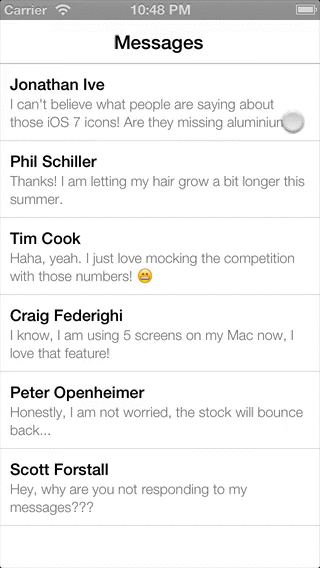

iOS2.1
============

UI Lab
------------

The goal of this lab is to replicate the UI below:

The goal is to create a UITableView with 'swipeable' cells. This is a very common UI pattern used in mobile apps, 'swiping' to reveal extended functionality.

Goals
------------

- You should create a `UITableViewCell` that can display a bold title and summary text underneath (2 lines).
- You should be able to swipe on a `UITableViewCell` and reveal the UI underneath.
- The UI underneath should have a `delete` button, which you can press to delete the cell from the list.

Bonus
-----------

- How would we handle adding 'elasticity' to the cell, eg: Allowing the user to swipe it further, but when they release, it bounces back. Can you do this?

Tips
------------

- You will need to use a UIPanGestureRecognizer to handle the 'swipe' effect. 
- There are many open source components out there to do this exact thing, feel free to consult some of them for advice, although you may find them far more complex than is necessary.
- You will want to think about your view hierarchy, which view is going to swipe out? Where are the 'underneath' views?
