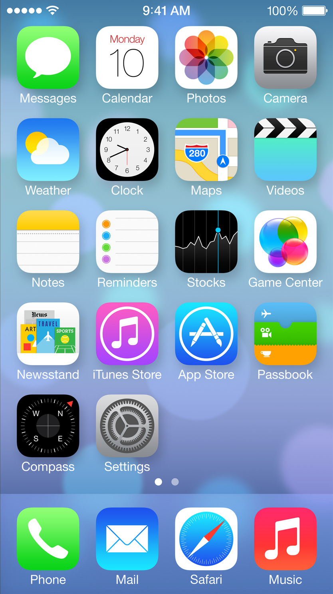

iOS2 Lab Test
======================

The goal of this lab test is to replicate the iPhone home screen below:

You do not need to replicate icon images, they can just be flat colors.

Once you have replicated the homescreen layout, you should implement the app deletion animation seen in the video below:

[video](deletion.mov)

The deletion animation works as follows:

- Long press on an icon to initiate the animation.
- After this, the icons all begin to shake.
- Each icon now also has a circle with an 'x' in it in the top left.
- Tapping this x presents a dialog asking you to confirm deletion.

Grading
================
- 30% for replicating the layout and icons. (They have rounded corners, drop shadows, etc).
- 10% for replicating the long press to enter 'delete mode'.
- 30% for replicating the icon shake.
- 20% for replicating the x and the 'confirm delete' dialog.
- 10% for code cleanliness / architecture.

Plagiarism
==============

You are free to use online resources for this test to guide you.

Do not blindly copy code from the web or other students. This may result in a grading penalty or involving the exam board.

Submission
==============

Please email a zip or (preferably) a link to a GitHub repository containing your code to zac@getdrop.com.
